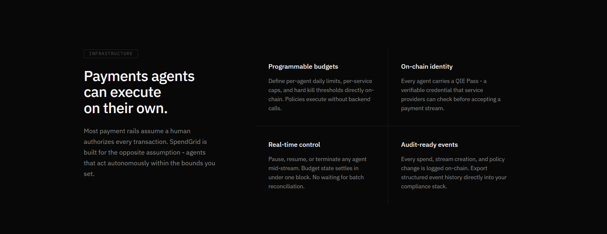
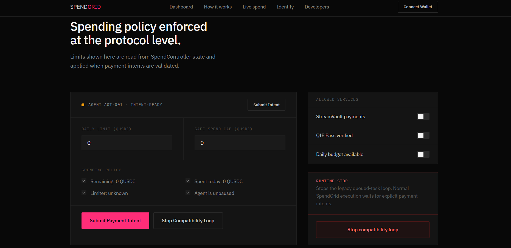

# SpendGrid

<p align="center">
  
</p>

<h3 align="center">
Intent-Driven Agentic Payments for the QIE Ecosystem
</h3>

<p align="center">
Policy-Enforced • QIE Pass Verified • On-Chain Settlement • Developer Friendly
</p>

---

> [!IMPORTANT]
> **SpendGrid transforms payment execution into programmable infrastructure.**
>
> Applications submit payment intents, SpendGrid validates them through an on-chain policy engine, verifies QIE Pass identity, enforces budget and liquidity constraints, and settles transactions on QIE.

---

| Dashboard                   | Intent Validation                |
| --------------------------- | -------------------------------- |
|  |  |

| Transaction Execution       | Policy Engine            |
| --------------------------- | ------------------------ |
|  |  |

---

# The Problem

Current AI agents can autonomously make decisions, but safely allowing them to spend money remains one of the hardest problems in Web3.

Today's approaches suffer from several issues:

* Unlimited wallet access
* No programmable spending policies
* No verifiable identity layer
* No deterministic execution guarantees
* Poor auditability
* Difficult integration into existing applications

Developers are forced to either trust autonomous agents completely or manually approve every transaction.

Neither scales.

---

# The Solution

SpendGrid introduces an **intent-driven payment orchestration layer** for QIE.

Instead of letting AI agents spend directly from wallets, applications submit **Payment Intents**.

SpendGrid then:

* validates identity
* validates policy
* validates budget
* validates liquidity
* validates permissions
* verifies QIE Pass
* executes settlement

only when every constraint passes.

The result is deterministic, programmable, auditable agent payments.

---

# Core Idea

```
Application
      │
      │
Submit Payment Intent
      │
      ▼
SpendGrid Policy Engine
      │
      ├── Budget Check
      ├── Liquidity Check
      ├── QIE Pass Verification
      ├── Allowance Check
      ├── Agent Authorization
      └── Spending Policy
      │
      ▼
SpendGrid Vault
      │
      ▼
QIE Blockchain Settlement
```

---

# Why SpendGrid Exists

SpendGrid is not another wallet.

SpendGrid is not another payment gateway.

SpendGrid is infrastructure.

It provides an execution layer that sits between autonomous agents and on-chain settlement, ensuring every payment is policy-compliant before execution.

This allows developers to safely integrate AI-driven commerce into their applications without sacrificing security or transparency.

---

# Key Features

## Intent-Based Payments

Applications submit structured payment intents instead of directly transferring funds.

This separates **request generation** from **execution**.

---

## Agent Policy Engine

Every payment passes through a deterministic validation engine before execution.

Checks include:

* Agent active status
* Daily budget
* Remaining budget
* Liquidity availability
* Allowance verification
* Spending constraints
* QIE Pass verification
* Stream validity

---

## QIE Pass Integration

SpendGrid uses **QIE Pass** as the identity layer for payment authorization.

Every agent proves:

* ownership
* wallet binding
* pass binding
* registry membership
* whitelist eligibility

before settlement occurs.

Identity becomes programmable.

---

## Live On-Chain Execution

Approved payment intents execute directly on QIE Testnet through SpendGrid contracts.

Every settlement produces:

* transaction hash
* block number
* gas usage
* execution status
* audit trail

making the payment fully verifiable.

---

## Real-Time Dashboard

SpendGrid provides live operational visibility including:

* Active Agent
* Remaining Budget
* Daily Utilization
* Latest Validation
* Latest Execution
* QIE Pass Status
* Transaction History
* Intent Count
* Policy Decision
* Explorer Links

---

# QIE Ecosystem Integration

SpendGrid was designed specifically for the QIE ecosystem.

It integrates with:

* QIE Blockchain
* QIE Pass
* SpendController
* SpendVault
* QUSDC
* QIEDex Router
* Agent Registry

to provide programmable payment infrastructure for AI-native applications.

---

# Architecture Overview

```
                    +--------------------+
                    |  External App      |
                    +--------------------+
                              │
                              │
                      Payment Intent
                              │
                              ▼
                 +-----------------------+
                 | SpendGrid Backend API |
                 +-----------------------+
                              │
                              ▼
               +----------------------------+
               | SpendGrid Policy Engine     |
               +----------------------------+
                 │
                 ├── QIE Pass
                 ├── Budget
                 ├── Liquidity
                 ├── Allowance
                 ├── Registry
                 └── Spending Rules
                              │
                              ▼
                  +----------------------+
                  | SpendGrid Contracts  |
                  +----------------------+
                              │
                              ▼
                     QIE Blockchain
```

---

# Design Philosophy

SpendGrid follows one simple principle:

> **Never execute first. Validate first.**

Every payment must prove that:

* the agent exists
* the identity is valid
* policy allows execution
* sufficient liquidity exists
* spending limits are respected
* authorization is correct

before settlement occurs.

This transforms autonomous payments from blind execution into programmable infrastructure.

---

# Built for Agentic Commerce

SpendGrid enables:

* Autonomous subscriptions
* AI SaaS billing
* Autonomous API payments
* Agent marketplaces
* Machine-to-machine commerce
* Treasury automation
* Autonomous payroll
* On-chain recurring services
* Cross-agent coordination
* Intelligent budget management

without requiring applications to build payment logic themselves.

---

# Payment Lifecycle

SpendGrid follows a deterministic payment lifecycle that separates **intent creation** from **settlement execution**.

Every payment must successfully pass policy validation before any on-chain interaction occurs.

```text
User / Application
        │
        │ POST /payment-intents
        ▼
+----------------------+
| SpendGrid API Layer  |
+----------------------+
        │
        ▼
+----------------------+
| Policy Engine        |
+----------------------+
        │
        ├── Agent Status
        ├── QIE Pass
        ├── Budget Rules
        ├── Spending Limits
        ├── Liquidity
        ├── Allowance
        ├── Registry Check
        └── Stream Rules
        │
        ▼
Policy Decision
        │
 ┌──────┴─────────┐
 │                │
Reject        Approve
 │                │
 ▼                ▼
Audit Log    Smart Contracts
                     │
                     ▼
          QIE Blockchain Settlement
```

---

# Payment Intent Model

Every payment begins as a structured intent object.

```json
{
  "agentId": "1",
  "recipient": "0xRecipient",
  "amount": "1.0",
  "currency": "QUSDC",
  "metadata": {
    "task": "API inference",
    "source": "dashboard"
  }
}
```

SpendGrid never blindly executes requests.

Instead, the intent enters the policy engine where multiple validation layers are evaluated before execution.

---

# Policy Engine

The Policy Engine is the core intellectual property of SpendGrid.

It acts as an autonomous gatekeeper between application requests and blockchain settlement.

Validation includes:

| Validation             | Purpose                    |
| ---------------------- | -------------------------- |
| Agent Exists           | Prevent unknown agents     |
| Agent Active           | Ensure agent is enabled    |
| QIE Pass Verification  | Identity enforcement       |
| Wallet Binding         | Confirm ownership          |
| Registry Check         | Registry membership        |
| Operator Authorization | Authorized execution       |
| Budget Remaining       | Prevent overspending       |
| Daily Limit            | Daily spending enforcement |
| Allowance Check        | ERC20 approval validation  |
| Liquidity Check        | Ensure funds exist         |
| Stream Validation      | Stream integrity           |
| Pause State            | Emergency stop mechanism   |

If **any** validation fails, execution stops immediately.

---

# Intent Status Flow

```text
Received

↓

Validating

↓

Policy Engine

↓

Approved ─────────────── Reject

↓

Create Stream

↓

Execute Payment

↓

Confirmed On-Chain

↓

Settlement Complete
```

---

# Smart Contract Architecture

SpendGrid uses multiple contracts that each perform a dedicated role.

```text
                    SpendGrid
                        │
        ┌───────────────┼───────────────┐
        │               │               │
        ▼               ▼               ▼
 Agent Registry   SpendController   SpendVault
        │               │               │
        │               │               │
        ▼               ▼               ▼
   Agent State     Budget Rules     Settlement
                                        │
                                        ▼
                                  QUSDC Transfer
                                        │
                                        ▼
                                   QIE Blockchain
```

---

# Contract Responsibilities

| Contract        | Responsibility           |
| --------------- | ------------------------ |
| Agent Registry  | Stores registered agents |
| SpendController | Budget enforcement       |
| SpendVault      | Payment execution        |
| QIE Pass        | Identity verification    |
| QUSDC           | Stablecoin settlement    |
| QIEDex Router   | Liquidity routing        |

---

# QIE Pass Verification

Every payment requires identity verification.

SpendGrid validates:

* Pass ownership
* Wallet binding
* Agent binding
* Registry binding
* Active status
* Vault whitelist eligibility

before allowing settlement.

This creates programmable identity enforcement for autonomous commerce.

---

# Live Runtime

The runtime exposes live state through backend APIs.

Example:

```
GET /agent/snapshot
```

Returns:

* Runtime status
* Active agent
* Remaining budget
* Daily spend
* Latest validation
* Latest execution
* Transaction hash
* QIE Pass state
* Intent count
* Liquidity status

The frontend consumes this data through polling and server-sent events (SSE).

---

# API

## Submit Payment Intent

```
POST /payment-intents
```

Example:

```json
{
  "agentId":"1",
  "recipient":"0xRecipient",
  "amount":"1.0"
}
```

Returns:

```json
{
    "status":"accepted",
    "intentId":"..."
}
```

---

## Agent Snapshot

```
GET /agent/snapshot
```

Returns current runtime state.

---

## Event Stream

```
GET /agent/events
```

Provides live server-sent events used by the dashboard.

---

# SDK Example

```javascript
import SpendGridSDK from "@spendgrid/sdk";

const sdk = new SpendGridSDK({
    backendUrl: "https://api.spendgrid.xyz"
});

await sdk.pay({
    recipient,
    amount: "1.0",
    agentId: "1"
});
```

The SDK does not directly spend funds.

It submits a payment intent that must pass policy validation before execution.

---

# Repository Structure

```text
SpendGrid/

├── backend/
│     ├── services/
│     ├── routes/
│     ├── contracts/
│     └── server.js
│
├── frontend/
│     ├── src/
│     ├── hooks/
│     ├── pages/
│     └── components/
│
├── sdk/
│
├── contracts/
│
├── docs/
│
└── README.md
```

---

# Deployment

## Frontend

Deploy to Vercel.

```
npm install

npm run build

vercel deploy
```

---

## Backend

Deploy to Render.

```
npm install

npm start
```

Configure environment variables:

```
RPC_URL=

PRIVATE_KEY=

QUSDC_ADDRESS=

REGISTRY_ADDRESS=

CONTROLLER_ADDRESS=

VAULT_ADDRESS=
```

---

# Environment Variables

| Variable            | Purpose           |
| ------------------- | ----------------- |
| RPC_URL             | QIE RPC endpoint  |
| PRIVATE_KEY         | Runtime signer    |
| REGISTRY_ADDRESS    | Agent Registry    |
| CONTROLLER_ADDRESS  | SpendController   |
| VAULT_ADDRESS       | SpendVault        |
| QUSDC_ADDRESS       | Stablecoin        |
| DEFAULT_DAILY_LIMIT | Default limit     |
| TEST_MODE_LIMIT     | Test spending cap |

---

# Why Intent-Based Payments Matter

Intent-based architecture separates **decision making** from **settlement execution**.

This allows:

* safer AI commerce
* deterministic audit trails
* programmable budgets
* protocol composability
* reusable payment infrastructure
* third-party integrations

Applications simply request payment.

SpendGrid safely decides whether that payment should execute.

---

# Security Model

SpendGrid was designed around one principle:

> **Execution should never happen before validation.**

Every payment intent must satisfy multiple independent checks before any on-chain settlement occurs.

The protocol enforces:

* Agent registration
* Agent active status
* QIE Pass verification
* Wallet ownership verification
* Registry membership
* Vault whitelist verification
* Budget enforcement
* Daily spending limits
* Liquidity availability
* ERC20 allowance validation
* Stream validation
* Operator authorization

If any check fails, execution is aborted and an audit event is emitted.

---

# Threat Protection

SpendGrid protects against several common risks associated with autonomous agents.

| Threat                    | Mitigation                 |
| ------------------------- | -------------------------- |
| Unlimited AI spending     | Budget controller          |
| Unauthorized execution    | Operator authorization     |
| Unknown agents            | Registry verification      |
| Fake identities           | QIE Pass verification      |
| Empty wallets             | Liquidity checks           |
| Missing approvals         | ERC20 allowance validation |
| Invalid streams           | Stream validation          |
| Budget exhaustion         | Daily spending enforcement |
| Compromised agents        | Pause mechanism            |
| Unauthorized vault access | Vault whitelist            |

---

# Why QIE Pass Matters

Traditional wallets only prove ownership.

SpendGrid extends identity into programmable policy enforcement through **QIE Pass**.

Every payment proves:

* who the agent is
* which wallet owns it
* whether it is registered
* whether it is authorized
* whether it belongs to an approved vault

before settlement is allowed.

This transforms identity into infrastructure rather than metadata.

---

# Use Cases

SpendGrid enables a wide variety of autonomous payment applications.

## AI API Billing

Agents can autonomously pay for inference, APIs, or external services while respecting programmable budgets.

---

## Autonomous SaaS

Software agents can subscribe, renew, and manage recurring services without human intervention.

---

## Machine-to-Machine Commerce

Autonomous systems can purchase resources from one another while maintaining verifiable policy enforcement.

---

## Treasury Automation

Organizations can automate treasury operations with deterministic spending rules.

---

## Agent Marketplaces

Developers can safely monetize autonomous agents by delegating payment execution to SpendGrid.

---

## Subscription Infrastructure

Recurring blockchain payments become programmable and policy-aware instead of requiring direct wallet access.

---

# Future Roadmap

## Phase 1

* Intent API
* Policy Engine
* Dashboard
* QIE Pass verification
* SpendController integration
* SpendVault settlement

Completed.

---

## Phase 2

* Multi-agent orchestration

* Scheduled payments

* Streaming subscriptions

* Merchant webhooks

* SDK improvements

* Multi-token settlement

---

## Phase 3

* Cross-chain settlement

* AI marketplace integrations

* Enterprise policy management

* Risk scoring engine

* Autonomous treasury management

* Payment routing optimization

---

# Why Developers Build With SpendGrid

Developers should not have to reinvent payment infrastructure.

SpendGrid provides:

* identity verification

* policy enforcement

* spending controls

* settlement execution

* audit logs

* live runtime monitoring

* budget management

through one unified interface.

Applications simply create payment intents.

SpendGrid handles everything else.

---

# Protocol Components

```text
Frontend Dashboard

↓

Payment Intent API

↓

Policy Engine

↓

QIE Pass Validation

↓

SpendController

↓

SpendVault

↓

QUSDC Settlement

↓

QIE Blockchain
```

---

# Contract Addresses

| Component       | Address |
| --------------- | ------- |
| Agent Registry  | `0x9380c2C9a75E1Cd87329308B31bf7447eAFe6970` |
| SpendController | `0xDDe02252aebDdF65F4Ec373881F544107Bd62796` |
| SpendVault      | `0xe2337Ea67d24c98370c42F22C94496780D8503E0` |
| QUSDC           | `0x2D8a005c72C50f2961c58f91B5A6b651F045A7a0` |
| QIEDex Router   | `0x08cd2e72e156D8563B4351eb4065C262A9f553Ef` |
| WQIE            | `0x0087904D95BEe9E5F24dc8852804b547981A9139` |

---

# Live Deployment

[SpendGrid](https://spendgridlabs.vercel.app/)

---

# Socials

## SpendGrid

https://x.com/SpendGridLabs

---

## QIE Blockchain

https://x.com/qieblockchain

---

# Open Source

SpendGrid is open-source infrastructure built for the QIE ecosystem.

Developers are encouraged to build payment experiences, AI commerce products, and autonomous financial systems on top of its intent-driven architecture.

---

# Acknowledgements

Built during the QIE ecosystem hackathon.

Special thanks to the QIE team for building programmable infrastructure that enables autonomous on-chain applications.

---

# Vision

The future of AI is not simply intelligent agents.

The future is **economically autonomous agents** capable of safely interacting with decentralized financial infrastructure.

SpendGrid exists to make that future programmable.

---

# Built by

## **Estar Kunmi**

Blockchain Developer • Web3 Builder 

X:

[@kunmiii__](https://x.com/kunmiii__)

---

<p align="center">

**SpendGrid**

**Intent-Driven Agentic Payments for QIE**

Policy-Enforced • Identity-Verified • On-Chain • Programmable

</p>


